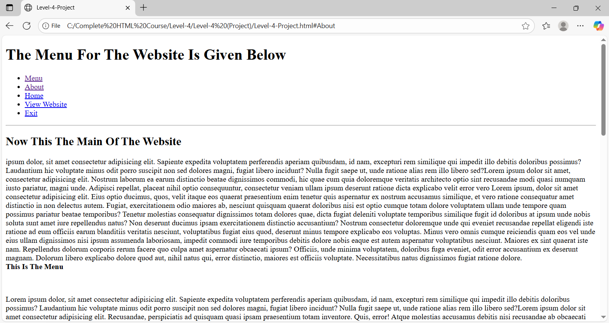
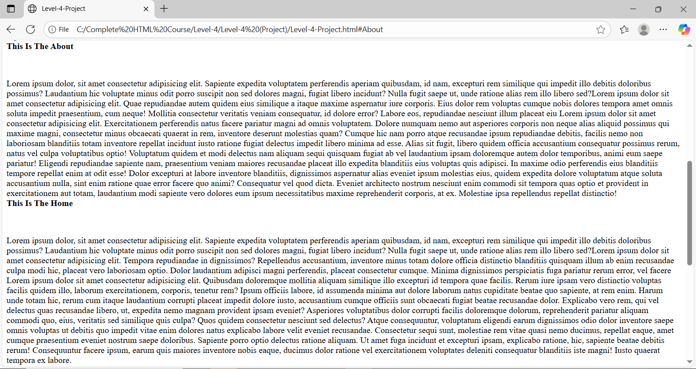
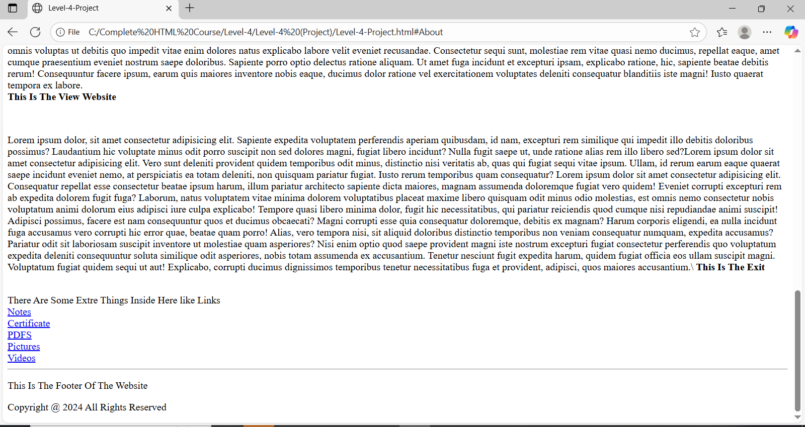

# Level-4 Project – Static Website (HTML Only)

## Overview
This repository contains a simple, clean **single‑page static website** built with semantic HTML. It demonstrates a classic layout that’s perfect for practice or small information sites: a header with navigation, a main content area split into a primary section and an aside, and a footer. The navigation links are **internal anchors** that jump to five content blocks (Menu, About, Home, View Website, Exit). This project is intentionally lightweight—no frameworks, no build tools—so you can focus on learning and improving your HTML structure.

## Features
- Semantic tags: `<header>`, `<nav>`, `<main>`, `<section>`, `<article>`, `<aside>`, and `<footer>`
- Anchor‑based navigation to in‑page sections (IDs match nav items)
- Example content that can be replaced with your own text and media
- Minimal setup: open `index.html` directly in a browser
- Ready for GitHub Pages (serve as a simple portfolio/demo page)

## Getting Started
1. Clone or download this repository.
2. Place your `index.html` in the project root (already provided by you).
3. Double‑click `index.html` to preview locally, or use a local server if you prefer.
4. (Optional) Deploy on **GitHub Pages**: push to `main`, then enable Pages in repo settings and select `main` → `/root`.

## Suggested Structure
```
.
├─ index.html
├─ README.md
├─ LICENSE
└─ .gitignore
```
You can add folders like `assets/`, `images/`, or `styles/` later.

## Customization Tips
- Update the `<title>` to match your brand.
- Keep ID values and nav links in sync (e.g., `href="#Menu"` ↔ `id="Menu"`).
- Replace placeholder text with real content; consider adding CSS for styling.
- Validate with the W3C HTML validator for best practices.


## 📸 Screenshots

### 🔹 Screenshot 1


### 🔹 Screenshot 2


### 🔹 Screenshot 3



## License
Licensed under the **MIT License**. See `LICENSE` for details.
